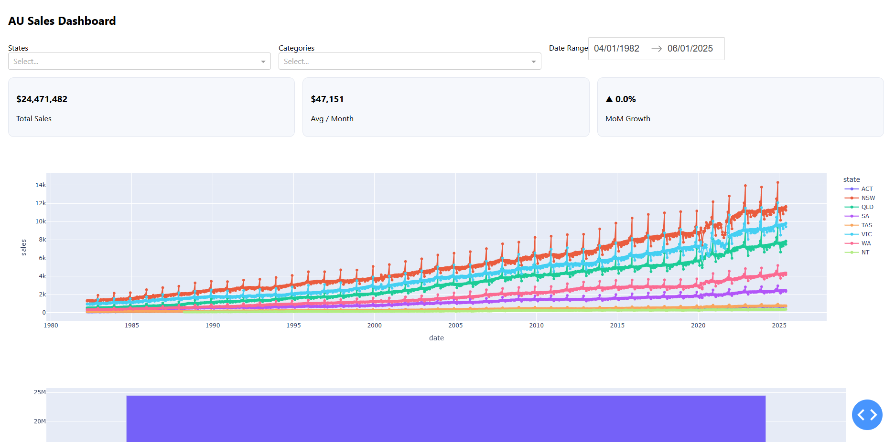

# AU Sales Dashboard

Interactive sales dashboard for Australian retail data using **Python**, **Dash**, and **Plotly**.  
This project is designed as a professional portfolio piece, showcasing clean architecture, data handling, testing, and deployment.

---

## 🚀 Features

- Load and process sales datasets (mock + real ABS data).
- Interactive filters (State, Category, Date range).
- Line and bar charts for trends and comparisons.
- KPI summary cards and top category tables.
- Clean code structure with modular design.
- Unit tests with **pytest** and code quality tools (**black**, **isort**, **ruff**).
- Deployment-ready on **Render**.

---

## 📂 Repository Structure

```
au-sales-dashboard/
├─ src/                   # app source code
│  ├─ app.py              # main Dash entrypoint
│  ├─ config.py           # configuration (paths, constants)
│  ├─ logging_conf.py     # logging setup
│  ├─ data/               # data loaders & transforms
│  │   ├─ loaders.py
│  │   └─ transforms.py
│  └─ ui/                 # layout & callbacks
│      ├─ layout.py
│      ├─ callbacks.py
│      └─ __init__.py
├─ data/                  # raw datasets (CSV / ABS XLSX)
│  └─ raw/                # (place your data files here)
├─ tests/                 # unit tests
│  └─ test_loaders.py
├─ requirements.txt       # Python dependencies
├─ pytest.ini             # pytest configuration
├─ .gitignore             # ignore venv, __pycache__, etc.
├─ LICENSE
└─ README.md              # project overview & usage

```

---

## 🛠️ Setup & Run (Local)

```bash
# Clone repository
git clone https://github.com/TomHuynhAU/au-sales-dashboard.git
cd au-sales-dashboard

# Setup virtual environment
python -m venv .venv
source .venv/bin/activate   # Windows: .venv\Scripts\activate

# Install dependencies
pip install -r requirements.txt

# Run tests
pytest -q

# Start Dash app
python -m src.app
```

Then open [http://127.0.0.1:8050](http://127.0.0.1:8050) in your browser.

---

## 📸 Demo



---

## 📊 Data Sources

- Mock dataset: `data/raw/sales_mock.csv`
- Real dataset: Australian Bureau of Statistics (ABS) Retail Trade Data [link coming soon].

---

## 🌐 Deployment

This app can be deployed on [Render](https://render.com) using `render.yaml` or `Procfile`.

---

## 📜 License

This project is licensed under the MIT License.
